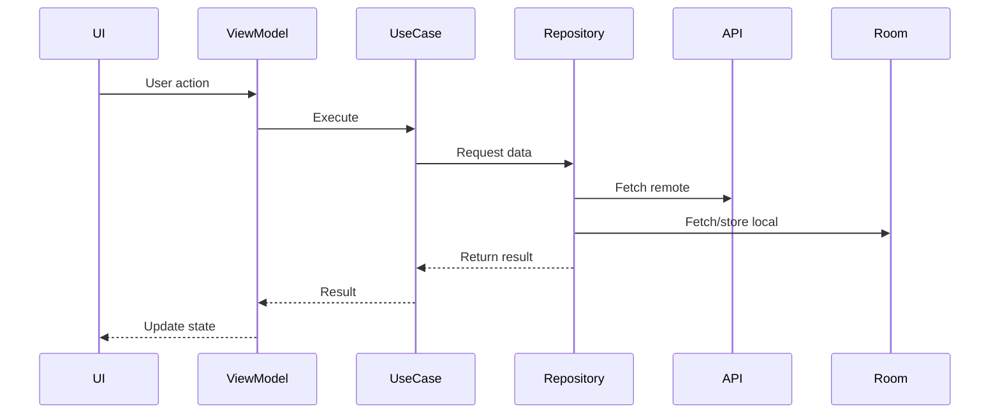

```markdown
# Architecture Documentation

## Layer Responsibilities

### Presentation Layer
- **UI**: Built with Jetpack Compose and Material3.
- **ViewModel**: Exposes state to the UI, handles lifecycle awareness, launches coroutines with `viewModelScope`.

### Domain Layer
- **Use Cases**: Encapsulate business logic. Each use case performs a single responsibility (e.g., `GetUsersUseCase`, `GetDogBreedsUseCase`).
- **Entities**: Core business models independent of frameworks.

### Data Layer
- **Repositories**: Coordinate between remote APIs and local Room database. Provide unified `Result<T>` responses.
- **Data Sources**:
  - **Remote**: Retrofit + OkHttp for API calls.
  - **Local**: Room for offline caching.
  - **Mock**: MockDataSource for dev/mock variants.

---

## Data Flow



- **Flow**: UI → ViewModel → UseCase → Repository → Data Sources → back to UI.
- **Offline Handling**: Repository falls back to Room cache when API fails or network is unavailable.

---

## Dependency Injection Strategy

- **Hilt** is used for DI.
- Each layer declares its dependencies via constructor injection.
- Example:
  - `UserRepositoryImpl` injected with `UserApi`, `UserDao`, `MockDataSource`, `Application`.
  - ViewModels annotated with `@HiltViewModel` and injected with use cases.
- **Navigation**: `hilt-navigation-compose` integrates DI with Compose navigation.

---

## Error Handling Patterns

- **Result<T>** wrapper used across repositories.
  - `Result.success(data)` for successful responses.
  - `Result.failure(exception)` for errors.
- **Fallback logic**:
  - If API fails → check Room cache.
  - If cache empty → propagate error.
- **Logging**:
  - Timber used for structured logs.
  - Controlled via `BuildConfig.ENABLE_LOGGING`.

---

## State Management

- **ViewModel + StateFlow**:
  - ViewModels expose immutable `StateFlow` to UI.
  - UI collects state and re‑composes automatically.
- **UI States**:
  - `Loading`, `Success`, `Error` sealed classes used to represent screen state.
- **Polling**:
  - Lifecycle‑aware polling implemented with `repeatOnLifecycle`.
  - Ensures jobs stop in background and resume in foreground.
  - Prevents duplicate jobs with a `PollingStatusManager`.

---

## Summary

- **Presentation**: Compose UI + ViewModel (state management).
- **Domain**: Use cases encapsulating business logic.
- **Data**: Repository pattern with Retrofit, Room, MockDataSource.
- **DI**: Hilt for dependency injection.
- **Error Handling**: Unified `Result<T>` + fallback to cache.
- **State Management**: ViewModel + StateFlow, lifecycle‑aware polling.
