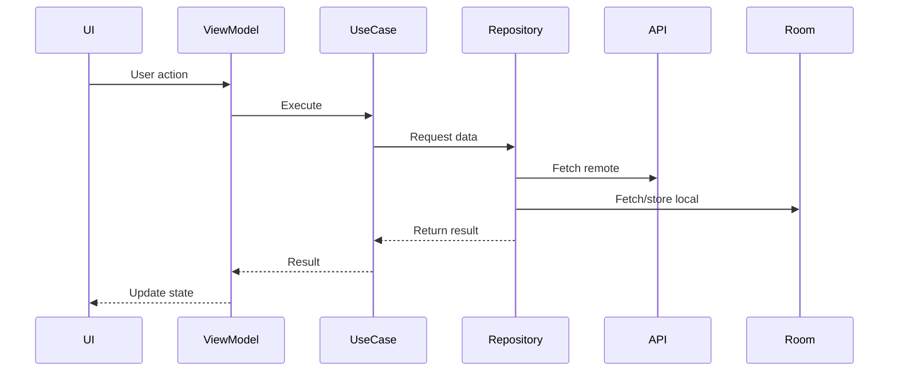

```markdown
# Architecture Documentation

## Layer Responsibilities

### Presentation Layer
- **UI**: Built with Jetpack Compose and Material3.
- **ViewModel**: Each feature has its own ViewModel inside its screen package (e.g., `presentation/breeds/screen`, `presentation/users/screen`).  
  ViewModels expose state via `StateFlow`, handle lifecycle awareness with `viewModelScope`, and manage polling jobs.

### Domain Layer
- **Use Cases**: Encapsulate business logic. Each use case performs a single responsibility (e.g., `GetUsersUseCase`, `GetDogBreedsUseCase`).
- **Domain Models**: Represent core business entities, independent of frameworks.
- **Repository Interfaces**: Define contracts for data access, implemented in the data layer.

### Data Layer
- **Local**: Room database entities and DAOs for offline caching.
- **Remote**: Retrofit services for API calls.
- **Repository Implementations**: Bridge between domain interfaces and data sources, handling caching, error fallback, and mock injection.
- **Models/DTOs**: Data transfer objects for API and DB mapping.

### Dependency Injection Layer
- **Modules**: Hilt modules (`AppModule`, `NetworkModule`, `DatabaseModule`) provide dependencies for repositories, APIs, and DAOs.

### Utilities
- **AppLogger**: Centralized logging (Timber).
- **NetworkState**: Network availability checks.
- **Extensions**: Common Kotlin extension functions.

---

## Data Flow



- **Flow**: UI → ViewModel → UseCase → Repository → Data Sources → back to UI.
- **Offline Handling**: Repository falls back to Room cache when API fails or network is unavailable.

---

## Dependency Injection Strategy

- **Hilt** is used for DI.
- Each layer declares its dependencies via constructor injection.
- Example:
  - `UserRepositoryImpl` injected with `UserApi`, `UserDao`, `MockDataSource`.
  - ViewModels annotated with `@HiltViewModel` and injected with use cases.
- **Navigation**: `hilt-navigation-compose` integrates DI with Compose navigation.

---

## Error Handling Patterns

- **Result<T>** wrapper used across repositories.
  - `Result.success(data)` for successful responses.
  - `Result.failure(exception)` for errors.
- **Fallback logic**:
  - If API fails → check Room cache.
  - If cache empty → propagate error.
- **Logging**:
  - Timber used for structured logs.
  - Controlled via `BuildConfig.ENABLE_LOGGING`.

---

## State Management

- **ViewModel + StateFlow**:
  - ViewModels expose immutable `StateFlow` to UI.
  - UI collects state and re‑composes automatically.
- **UI States**:
  - `Loading`, `Success`, `Error` sealed classes used to represent screen state.

---

## Polling Implementation

### Approach
- Polling is implemented using **coroutines** inside ViewModel.
- A repeating job (`pollingJob`) fetches data at fixed intervals (every 35 seconds).
- Lifecycle awareness is ensured by wrapping polling in `repeatOnLifecycle(Lifecycle.State.STARTED)` inside a `LaunchedEffect`.

### Lifecycle Handling
- **Foreground**: Polling runs continuously while the lifecycle is in `STARTED`.
- **Background**: Polling job is canceled automatically when lifecycle stops.
- **Destroyed**: `onCleared()` ensures polling is stopped when the ViewModel is destroyed.

### Duplicate Prevention
- `pollingJob?.isActive == true` check prevents multiple jobs from running simultaneously.
- `PollingStatusManager` tracks whether polling is active and records the last fetch time.

### Performance Considerations
- **Interval**: 35 seconds chosen to balance freshness vs. battery/network usage.
- **Caching**: Room database used to avoid unnecessary API calls when offline.
- **Logging**: Each cycle logs start time, success/failure, and number of items fetched.

### Example Flow
1. UI triggers polling via `LaunchedEffect(lifecycleOwner)`.
2. `repeatOnLifecycle` starts polling when lifecycle enters `STARTED`.
3. ViewModel launches a coroutine with `viewModelScope`.
4. Loop calls `fetchBreeds()` → repository fetches from API or Room.
5. On success: update state, log, update `PollingStatusManager`.
6. On failure: log error, fallback to cache, update status.
7. UI state updates via `StateFlow`.

---

## Summary

- **Presentation**: Compose UI + ViewModel (state management + polling).
- **Domain**: Use cases encapsulating business logic.
- **Data**: Repository pattern with Retrofit, Room, MockDataSource.
- **DI**: Hilt for dependency injection.
- **Error Handling**: Unified `Result<T>` + fallback to cache.
- **State Management**: ViewModel + StateFlow.
- **Polling**: Lifecycle‑aware, duplicate‑safe, performance‑optimized.
