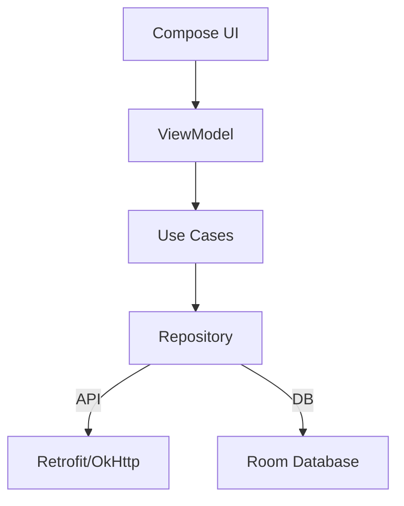
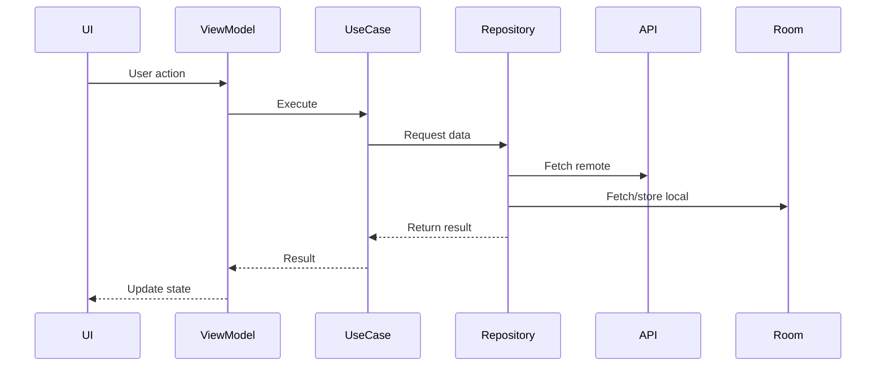

```markdown
# Elytra Studios Assessment

## Project Overview
This project is a Jetpack Compose–based Android application built with **Clean Architecture** principles. It demonstrates modern Android development practices including lifecycle‑aware polling, offline caching with Room, dependency injection with Hilt, and networking with Retrofit/OkHttp.

### Architecture Diagram


### Key Features
- Jetpack Compose UI with Material3
- Clean Architecture layering (UI → ViewModel → UseCase → Repository → Data)
- Offline caching with Room
- Retrofit + OkHttp networking
- Hilt dependency injection
- Build variants: dev, mock, prod
- Lifecycle‑aware polling mechanism
- Logging with Timber

---

## Setup Instructions

### Prerequisites
- **Android Studio**: Latest stable (Arctic Fox or newer)
- **JDK**: 17+
- **Gradle**: 8.x (bundled with Android Studio)

### Steps
1. Clone the repository:
   ```bash
   git clone https://github.com/elytrastudios/assessment.git
   cd assessment
   ```
2. Open in Android Studio.
3. Sync Gradle files (`File > Sync Project with Gradle Files`).
4. Select build variant:
   - `devDebug` → development with mock + logging
   - `mockDebug` → mock data testing
   - `prodRelease` → production build with ProGuard enabled
5. Command line builds:
   ```bash
   ./gradlew assembleDevDebug
   ./gradlew assembleMockDebug
   ./gradlew assembleProdRelease
   ```

---

## Architecture Explanation

### Clean Architecture Layers
- **Presentation**: Compose UI + ViewModel
- **Domain**: Use cases (business logic)
- **Data**: Repository pattern, Room, Retrofit
- **External**: APIs, DB, logging

### Data Flow Diagram


### Dependency Directions
- UI depends on ViewModel
- ViewModel depends on UseCase
- UseCase depends on Repository
- Repository depends on Data sources (API, Room)

---

## Build Variants Explanation

- **Debug (dev)**  
  - Logging enabled  
  - Mock data enabled  
  - App name suffix `(Dev)`  

- **Mock**  
  - Logging enabled  
  - Mock data enabled  
  - App name suffix `(Mock)`  

- **Prod (Release)**  
  - Logging disabled  
  - Real API calls  
  - ProGuard enabled  
  - App name suffix `(Prod)`  

### Mock Data Injection
- Controlled via `BuildConfig.USE_MOCK` flag.
- Mock data source provides fake API responses.

### Logging Control
- Controlled via `BuildConfig.ENABLE_LOGGING`.
- Timber used for structured logging.

---

## API Documentation

### Dog API
- **Endpoint**: `GET /breeds/list/all`
- **Response**:
  ```json
  {
    "message": {
      "bulldog": ["french", "english"],
      "retriever": ["golden", "labrador"]
    },
    "status": "success"
  }
  ```

### User API
- **Endpoint**: `GET /users`
- **Response**:
  ```json
  [
    {
      "id": 1,
      "name": "Leanne Graham",
      "username": "Bret",
      "email": "Sincere@april.biz",
      "address": { ... },
      "phone": "1-770-736-8031",
      "website": "hildegard.org",
      "company": { ... }
    }
  ]
  ```

### Error Handling
- Network unavailable → fallback to Room cache
- API failure → fallback to Room cache
- No cache available → `Result.failure(Exception("No data"))`

---

## Polling Mechanism

### Implementation
- Lifecycle‑aware polling using `repeatOnLifecycle` in ViewModel.
- Polling stops when app goes to background, resumes in foreground.

### Lifecycle Handling
- ViewModel launches coroutine with `viewModelScope`.
- Polling job canceled automatically when lifecycle is destroyed.

### Performance Considerations
- Avoids duplicate jobs with `PollingStatusManager`.
- Updates timestamp on each fetch.
- Uses Room cache to minimize API calls when offline.
